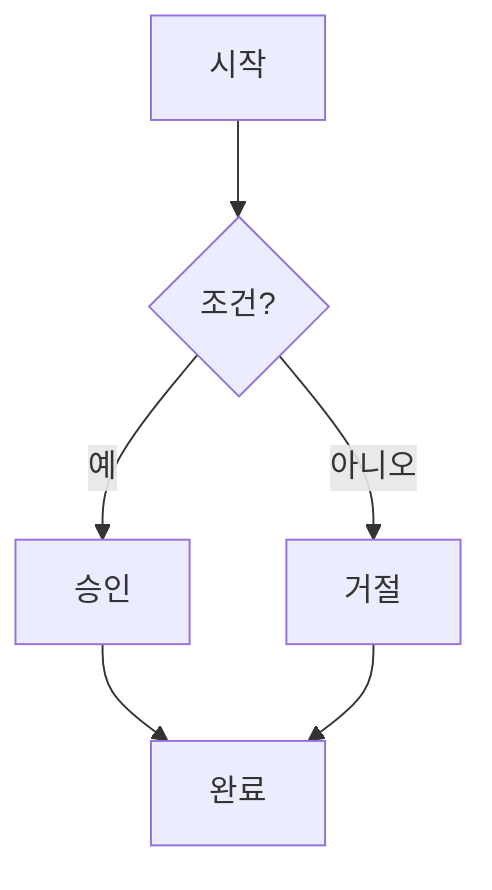

# Markdown에서 Mermaid 다이어그램 추가하기

Mermaid 다이어그램은 코드 블록에 `mermaid` 언어 힌트를 붙여 작성합니다. 아래 예시는 간단한 흐름도를 만드는 방법입니다.



## 작성 순서
1. 삼중 백틱(```)으로 코드 블록을 연다.
2. 첫 줄에 언어 힌트로 `mermaid`를 적는다.
3. Mermaid 문법으로 다이어그램 내용을 작성한다.
4. 삼중 백틱으로 코드 블록을 닫는다.

## 자주 쓰는 다이어그램 종류
- `graph TD` 또는 `graph LR` : 흐름도(Top-Down, Left-Right)
- `sequenceDiagram` : 시퀀스 다이어그램
- `classDiagram` : 클래스 다이어그램
- `stateDiagram` : 상태 다이어그램

## 미리보기 팁
- GitHub, GitLab, Notion 등은 기본적으로 Mermaid 블록을 렌더링한다.
- 로컬에서 확인하려면 VS Code용 "Markdown Preview Mermaid Support" 같은 확장 기능을 사용하면 편리하다.

추가 문법과 예시는 [Mermaid 공식 문서](https://mermaid.js.org/)를 참고하세요.
