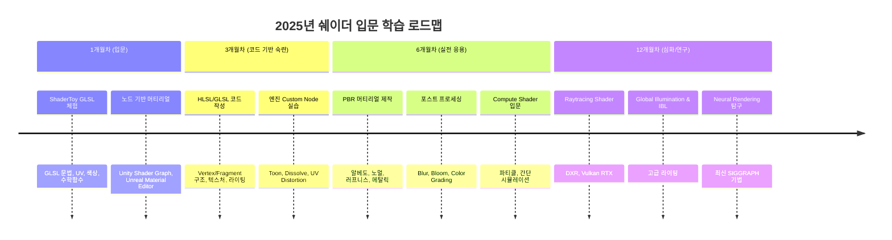

# 🎨 2025년 쉐이더 입문 로드맵

## 📚 개요
이 문서는 2025년 기준으로 **쉐이더 입문자가 따라가기 좋은 학습 경로**를 정리한 로드맵입니다.  
옛날 DirectX SDK/HLSL fx 파일 학습 대신, 현대적인 워크플로우(ShaderToy → 엔진 → 코드 → 심화)를 기반으로 구성했습니다.  

---

## 📅 학습 플랜

| 기간 | 목표 | 학습 내용 | 추천 실습/산출물 |
|------|------|-----------|-----------------|
| **1개월차 (입문)** | 쉐이더 개념 이해 + GLSL 맛보기 | - ShaderToy GLSL 문법 체험 - UV, 색상, sin/cos 애니메이션 - Unity Shader Graph / Unreal Material Editor | - 움직이는 패턴 - 색상 그라디언트 머티리얼 |
| **3개월차 (코드 기반 숙련)** | Vertex/Fragment 쉐이더 구조 학습 + 엔진 연동 | - HLSL/GLSL 기본 구조 - 텍스처 샘플링, 기본 라이팅 - 엔진 Custom Node 실습 | - Toon Shader - Dissolve 이펙트 - UV Distortion |
| **6개월차 (실전 응용)** | 엔진에서 활용 가능한 쉐이더 제작 | - PBR 원리 (알베도/노멀/러프니스/메탈릭) - 포스트프로세싱 (Bloom, Blur) - Compute Shader 입문 | - PBR 머티리얼 - 화면 블러 이펙트 - GPU 파티클 |
| **12개월차 (심화/연구)** | 최신 그래픽스 기법 탐구 | - Raytracing Shader (DXR/Vulkan RTX) - Global Illumination, IBL - Neural Rendering (SIGGRAPH 기법) | - 간단한 Raytracing Shader - Path Tracer 실험 - Neural Shader 프로토타입 |

---

## ⏱ 타임라인 다이어그램

---

## ✅ 핵심 포인트
- **옛날 DirectX SDK → X**  
- **현대 입문 루트 → ShaderToy → 엔진(Graph/Material) → HLSL/GLSL → Compute/RTX**  
- 학습 과정에서 바로 **실무/프로토타입에 적용 가능한 산출물** 확보 가능