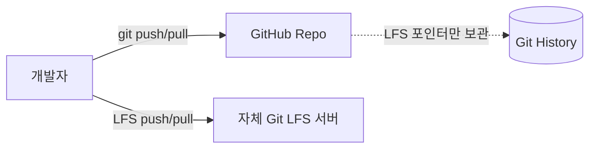

# GitHub 저장소 + 자체 Git LFS 서버 조합 가이드

> 깃 저장소는 GitHub에, 대용량 파일(LFS 오브젝트)은 **별도의 자체 LFS 서버**로 운영할 수 있습니다. 저장소 루트의 `.lfsconfig`로 **외부 LFS 엔드포인트**를 지정하면 협업자도 자동으로 그 서버를 사용하게 됩니다.

---

## 1) 아키텍처 개요

- **코드/히스토리**: GitHub 리포지터리
- **대용량 바이너리(에셋)**: 자체 Git LFS 서버 (HTTP(S)로 Git LFS API 제공)
- **연결 방식**: 저장소에 커밋된 `.lfsconfig`가 LFS 업·다운로드를 외부 서버로 라우팅



---

## 2) LFS 서버 선택지

- **lfs-test-server**: 간단·소규모용 도커 이미지
- **Giftless / Artifactory / Nexus 등**: 기업용 기능(권한·모니터링·GC 등)
- **직접 구현**: Git LFS API 규격 구현 필요(권장 X)

> 운영 고려: 인증(Basic/Auth Token), HTTPS, 백업·보존정책, 스토리지 용량/성능, GC(garbage collection)

---

## 3) 저장소에 외부 LFS 엔드포인트 지정

### `.lfsconfig` 커밋(권장)

프로젝트 루트에 파일을 만들고 커밋합니다.

```ini
# .lfsconfig
[lfs]
	url = "https://lfs.example.com/your-repo.git/info/lfs"
```

명령으로 생성할 수도 있습니다.

```bash
git config -f .lfsconfig lfs.url https://lfs.example.com/your-repo.git/info/lfs
git add .lfsconfig
git commit -m "Use external Git LFS endpoint"
```

> `.lfsconfig`가 커밋되어 있으면 협업자가 클론/체크아웃 시 자동으로 해당 LFS 서버를 사용합니다.

---

## 4) LFS 트래킹 규칙 설정(`.gitattributes`)

언리얼/게임 프로젝트 예시:

```gitattributes
*.uasset filter=lfs diff=lfs merge=lfs -text
*.umap   filter=lfs diff=lfs merge=lfs -text
*.png    filter=lfs diff=lfs merge=lfs -text
*.wav    filter=lfs diff=lfs merge=lfs -text
```

```bash
git lfs install
git lfs track "*.uasset" "*.umap" "*.png" "*.wav"
git add .gitattributes
git commit -m "Add LFS tracking rules"
```

---

## 5) 최소 동작 예시 (처음 셋업부터 푸시까지)

```bash
# 0) LFS 설치(개발자 PC)
git lfs install

# 1) LFS 트래킹 정의
git lfs track "*.uasset" "*.umap" "*.png" "*.wav"
git add .gitattributes

# 2) 외부 LFS 엔드포인트 지정(저장소 공유용으로 .lfsconfig 커밋)
git config -f .lfsconfig lfs.url https://lfs.example.com/your-repo.git/info/lfs
git add .lfsconfig
git commit -m "Configure external Git LFS endpoint"

# 3) 평소처럼 커밋/푸시 (코드는 GitHub, 대용량은 LFS 서버로 이동)
git add .
git commit -m "Add assets via LFS"
git push origin main
```

---

## 6) 중요 주의사항

- **GitHub ZIP/tarball 아카이브에 LFS 파일 미포함**  
  GitHub의 자동 ZIP 다운로드에는 LFS **포인터만** 들어갑니다. 실제 바이너리가 필요하면 `git clone` + LFS fetch가 필요합니다.

- **GitHub 일반 파일 크기 제한**  
  LFS로 추적되지 않은 100MB 이상의 파일은 GitHub로 푸시 시 거부될 수 있습니다. **반드시** `.gitattributes`를 먼저 설정하고 커밋하세요.

- **기존에 GitHub LFS를 쓴 이력과 혼합 금지**  
  과거 커밋 일부가 GitHub LFS, 일부가 외부 LFS로 섞이면 혼란이 큽니다.  
  - 히스토리 초반부터 `.lfsconfig`가 존재하도록 **히스토리 재작성**(필요 시)  
  - 또는 기존 LFS 오브젝트를 외부 LFS로 재푸시하여 **일관성**을 맞추는 것을 권장

- **인증**  
  외부 LFS 서버가 프라이빗이면 개발자/CI에서 인증 정보를 제공해야 합니다(Basic/Auth Token, 헤더, `.netrc` 등).

---

## 7) GitHub Actions(CI) 연동 팁

```yaml
# .github/workflows/build.yml
name: Build
on: [push, pull_request]
jobs:
  build:
    runs-on: ubuntu-latest
    steps:
      - name: Checkout (with LFS)
        uses: actions/checkout@v4
        with:
          lfs: true

      - name: Configure LFS auth for external server
        run: |
          cat > ~/.netrc <<'EOF'
          machine lfs.example.com
            login $LFS_USER
            password $LFS_TOKEN
          EOF
          chmod 600 ~/.netrc

      - name: Verify LFS files
        run: |
          git lfs fetch --all
          git lfs checkout
          git lfs ls-files
```

> 포인트  
> - `actions/checkout@v4`에서 `lfs: true` 설정  
> - 러너가 외부 LFS 서버에서 파일을 가져올 수 있도록 인증 정보를 환경변수/비밀 변수로 주입

---

## 8) 결론

- **가능 여부**: ✅ 네, **자체 LFS + GitHub 저장소** 조합은 정식 지원되는 일반적인 구성입니다.  
- **핵심 포인트**: `.lfsconfig`로 외부 엔드포인트를 커밋해 **팀 전체 일관성**, 인증/HTTPS/백업/보존정책 등 **운영 요소**를 챙길 것.  
- **주의**: GitHub의 ZIP 아카이브는 LFS 바이너리를 포함하지 않습니다(포인터만 포함).